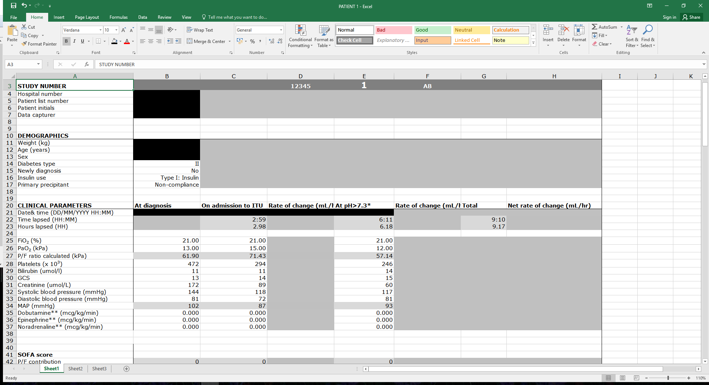

I recently helped a colleague with writing a script to load a number of spreadsheets into R. He was using Excel spreadsheets to enter data on individual cases with one spreadsheet containing all the longitudinal data for an individual, i.e. multiple observations per individual in each spreadsheet. He then wanted to combine the data for all the individuals for analysis. It was tedious to do so by hand to combine all the data points into a merged spreadsheet, so we set out to write script to do it. This is what the spreadsheet looked like initially (data has been anonymised):



```{r}
#Step 1. Load required libraries
library(readxl)

#Step 2. Find out the names of the spreadsheets you want to combine in the target folder
filenames <- sort(list.files(path = "data/", pattern="*.xlsx"))

#Step 3. Load all the variables into individual dataframes you name according to the number 
dfnames <- c(paste0("variables",1:length(filenames)))

for (i in 1:length(filenames)) {
        temp <- read_excel(paste0("data/",filenames[i]), sheet=1, skip=17, col_names=FALSE)[1:58,1:8]
        assign(dfnames[i], temp)
}

ls()

#Step 4. Repeat for demographics, treatment and time resolution
dfnames <- c(paste0("demographics",1:length(filenames)))
for (i in 1:length(filenames)) {
        temp <- read_excel(paste0("data/",filenames[i]), sheet=1, skip=2, col_names=FALSE)[1:12,1:2]
        assign(dfnames[i], temp)
}

dfnames <- c(paste0("treatments",1:length(filenames)))
for (i in 1:length(filenames)) {
        temp <- read_excel(paste0("data/",filenames[i]), sheet=1, skip = 77, col_names = FALSE)[1:36,]
        assign(dfnames[i], temp)
}

dfnames <- c(paste0("time_resolution",1:length(filenames)))
for (i in 1:length(filenames)) {
        temp <- read_excel(paste0("data/",filenames[i]), sheet = 1, skip = 115,col_names = FALSE)[1:5,1:4]
        assign(dfnames[i], temp)
}

ls()

#Step 5. Set up an empty dataframe to accept the values you want to choose
big_dataframe <- data.frame(id ="", 
                            pt_initials ="", 
                            weight ="", 
                            age ="",
                            sex ="",
                            diabetes_type ="",
                            new_dx ="",
                            insulin ="",
                            dx_time ="",
                            itu_time ="",
                            dx_fio2 ="",
                            itu_fio2 ="",
                            dx_pao2 ="",
                            itu_pao2 ="",
                            itu_hartmanns ="",
                            stringsAsFactors = FALSE
                            )

big_dataframe

#Step 6. Populate the cells of the dataframe with the data you want 
for (i in 1:length(filenames)) {
        big_dataframe[i,"id"] <- get(paste0("demographics", i))[1,2]
        big_dataframe[i,"pt_initials"] <- get(paste0("demographics", i))[2,2]
        big_dataframe[i,"weight"] <- get(paste0("demographics", i))[7,2]
        big_dataframe[i,"age"] <- get(paste0("demographics", i))[8,2]
        big_dataframe[i,"sex"] <- get(paste0("demographics", i))[9,2]
        big_dataframe[i,"diabetes_type"] <- get(paste0("demographics", i))[10,2]
        big_dataframe[i,"new_dx"] <- get(paste0("demographics", i))[11,2]
        big_dataframe[i,"insulin"] <- get(paste0("demographics", i))[12,2]
        big_dataframe[i, "dx_time"] <- get(paste0("variables", i))[2,2]
        big_dataframe[i, "itu_time"] <- get(paste0("variables", i))[2,3]
        big_dataframe[i, "dx_fio2"] <- get(paste0("variables", i))[6,2]
        big_dataframe[i, "itu_fio2"] <- get(paste0("variables", i))[6,3]
        big_dataframe[i, "dx_pao2"] <- get(paste0("variables", i))[7,2]
        big_dataframe[i, "itu_pao2"] <- get(paste0("variables", i))[7,3]
        big_dataframe[i, "itu_hartmanns"] <- get(paste0("treatments", i))[10,3]
}

summary(big_dataframe)

#Step 7. Clean up your now messy environment, leaving just the dataframe you're interested in
rm(list=setdiff(ls(), "big_dataframe"))
```

```{r}
sessionInfo()
```