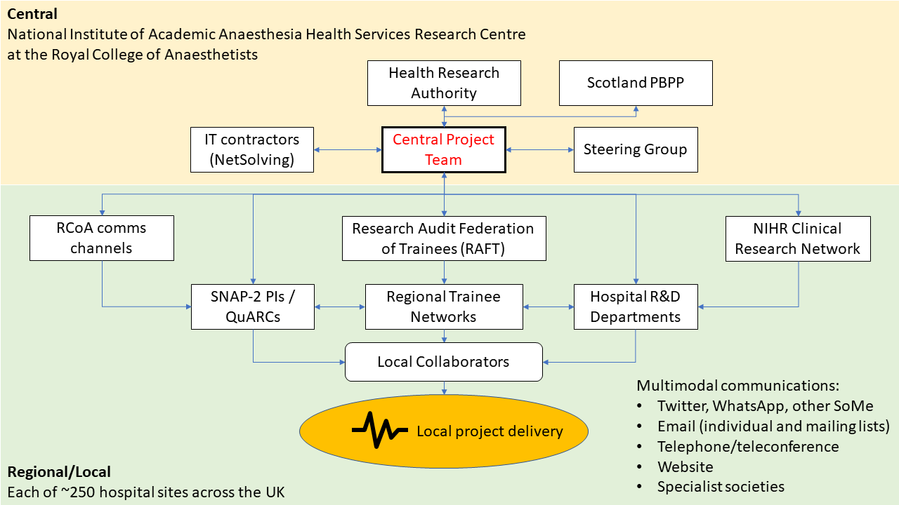

When I tell people about the [SNAP-2: EPICCS](http://dannyjnwong.github.io/SNAP-2-EPICCS/) study that I've been doing as part of my PhD, I often get asked questions like, "How did you manage all these sites?", "Do you have a big team working with you?", "How did you get all these sites on board?", etc.

The reason they ask this is we managed achieve something very special with SNAP-2: 

- We recruited just under 23,000 patients for our main study and surveyed about 10,000 clinicians over the course of only a week

- We coordinated over 2,800 collaborators across about 250 hospital sites in the 4 devolved nations of the UK

- We sustained collaborator enthusiasm to get follow-up data at 2 time-points (Day 7 and 60 post-op) for all the patients that remained in hospital, such that data completeness was in excess of 90%

- We did this all with a budget of less than £65,000

All these things were remarkable achievements in their own right, but in concert it was truly spectacular. So how did we do it?

I believe that a number of elements were in place which enabled us to deliver SNAP-2: EPICCS, and it can serve as a case study for anyone planning on conducting a similar large national study in the future. We must capitalise on the vast research infrastructure that has been developed and commit it to the UK Anaesthesia community's institutional memory, so that we do not have to constantly start from scratch and rethink how to do things.

## The Central Project Team: Experience

We had an excellent core team of 6 people within the [NIAA Health Service Research Centre](https://www.niaa-hsrc.org.uk/HSRC_home) at the Royal College of Anaesthetists, comprising the Chief Investigator, a statistical advisor, 3 administrative staff, and me doing most of the day-to-day project management. Our team had experience with a previous study ([SNAP-1](https://www.niaa-hsrc.org.uk/SNAP-1)), which was of a similar national scale, but lasting a shorter duration. We therefore could build on what was learned in running SNAP-1.

## Research Networks: Wide Reach

We utilised the research groupings that have been built up over the years within Anaesthesia UK. These groups of researchers could be thought of as 3 overlapping networks, and allowed us to reach out to almost all the UK NHS hospitals where Consultant Anaesthetists, Trainees and NIHR clinical research staff worked.

### The Quality Audit and Research Coordinators (QuARCs)

Almost all the hospitals in the UK have anaesthetic consultants who have volunteered to be [QuARCs](https://www.niaa-hsrc.org.uk/QUARCs?newsid=584), serving as a single point of contact for the NIAA HSRC to reach into sites for conducting research. They have now been involved in a number of studies and would have therefore built-up substantial experience in local data collection and relationships within their departments and with other departments to help facilitate research.

### Trainee Research Networks

The UK now has a very sophisticated infrastructure of 14 (and counting) trainee research networks, which cover virtually all regions, and sit underneath a national coordinating body called the [Research & Audit Federation of Trainees (RAFT)](http://www.raftrainees.com/). They promote a collaborative approach to research and offer junior anaesthetists and trainees the opportunity to contribute to research on the principle that the cumulative contribution of many individuals adds up to something greater.

### The National Insitute of Health Research Clinical Research Networks (NIHR CRN)

The [NIHR CRN](https://www.nihr.ac.uk/about-us/how-we-are-managed/managing-centres/crn/) is a UK Department of Health funded organisation that exists to help support and fund common research assets (equipment and personnel). We were fortunate that the NIAA HSRC is a partner organisation with the NIHR and therefore studies we run are eligible for NIHR CRN support.

## Royal College support: Authority

The [Royal College of Anaesthetists](https://www.rcoa.ac.uk/) is the central body for Anaesthetists in the UK. Membership and fellowship of the college is compulsory for trainees and consultants, and therefore almost all anaesthetists in the UK receive the communications issued by the college, in the form of: 1) the [Bulletin](https://www.rcoa.ac.uk/bulletin), a printed publication that is delivered to all members; 2) college emails; 3) communications through various sub-committees and working parties within the college, such as the College Tutors network. In effect, the college communications machinery can be mobilised to help encourage participation in big national studies of interests to all anaesthetists.

## Social Media: Personal Influence

Anaesthetists are among the most technologically savvy medical professionals out there and many are active on Twitter, Facebook and other social media platforms. Part of building enthusiasm for the study was establishing a presence on social media and generating excitement. For the average anaesthetist, research is often seen as an additional burden on top of the busy clinical workload they already have to shoulder. Therefore, to overcome the high inertia that exists preventing participation, research needs to be seen as fun and enjoyable. Building a community is integral in encouraging people to contribute. 

In addition to actively [Tweeting](https://twitter.com/SNAP2EPICCS) throughout the study and keeping people informed about the study's progress from gaining ethics, through to launching the study, and daily updates whilst the study was active, we also emailed out [Mailchimp](https://mailchimp.com/) newsletters with pictures of people conducting the study sent to us by our collaborators on each day of the study recruitment, interspersed with interesting nuggets of information to keep collaborators engaged.

We also used conventional means to communicate with our community, but augmented with technology: teleconferences were organised using an [Eventbrite](http://eventbrite.co.uk/) ticketing system to manage the teleconferences so that we could disseminate information to as many individuals simultaneously. Speaking directly to our collaborators was helpful in addressing questions directly and familiar

## Hospital Research Support Staff: Lubricating the engine

A large complicated study like ours required a lot of different people working together from different departments, with clinicians from the Anaesthetic suite to the Operating Theatres, and to the Intensive Care Units and Wards. Many clinicians only really ever work within one department of the hospital and seldom venture outside their siloes. We harnessed the interdepartmental expertise that existed within each hospitals' R&D departments. Research administrators, research nurses and research support workers who are used to conducting studies, and used to completing the necessary regulatory and governance documentation were involved early in the study process. We contacted each hospitals' R&D departments a few months before the study was due to launch and also asked that the QuARCs do so as well. 

## Putting it all together

How did this all come together in the delivery of the study? Lines of communication between all these elements were crucial. This diagram summarises how all the parts fitted in the jigsaw puzzle:




I hope that this overview will serve as a useful guide for anybody tasked with delivering a national project in the future. There are still many issues which I have not discussed in this post, such as working with external IT contractors, securing Research Ethics and Information Governance approvals, patient and public involvement in study design and obtaining external advice from experts to maximise scientific rigour, but I may get some time to blog about these in the future.

```{r}
sessionInfo()
```