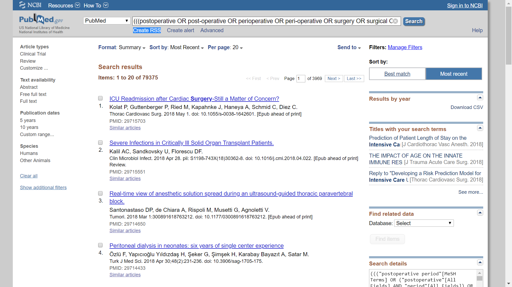
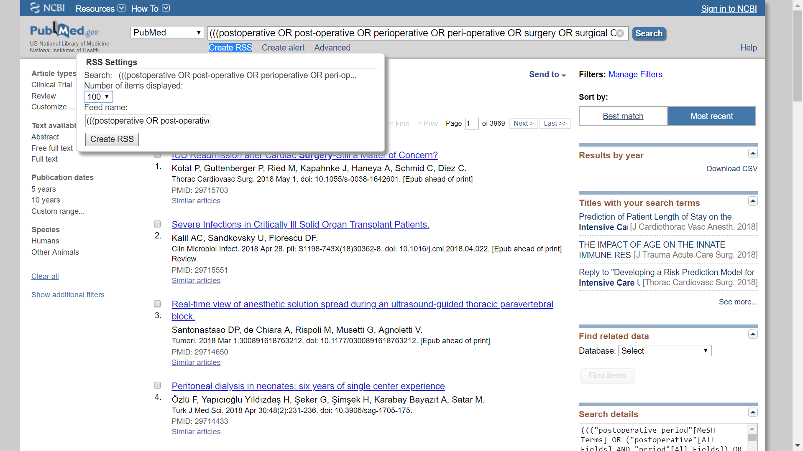
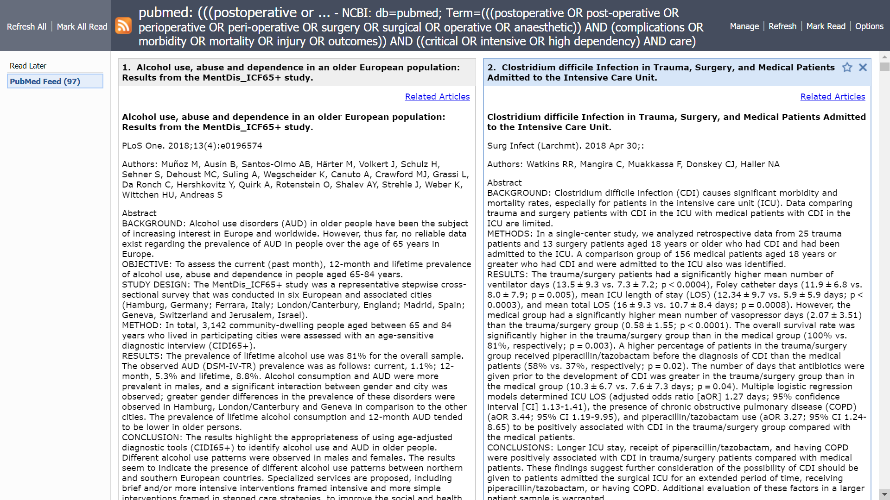

The medical literature changes so fast that it's terribly difficult to stay current. In pursuing my PhD, I've discovered that the old model of literature review -> formulate a question -> design an experiment/study -> do the study -> analyse -> write-up is terribly difficult to do in series. You constantly have to do EVERYTHING in parallel. 

Also by the time you get to the write-up stage, you realise that your literature review is horribly out-of-date! What can we do to fix this?

I've recently found out that [PubMed](https://www.ncbi.nlm.nih.gov/pubmed) has a brilliant RSS feed function. And so you can create a search of the literature base that you want to keep current with and then keep in refreshed in the background as an RSS feed. RSS stands for Really Simple Syndication. I'll walk you through getting one set up:

## 1. Create your search

Go to [PubMed](https://www.ncbi.nlm.nih.gov/pubmed) and create a search, it can be as simple or as complicated as you wish.



## 2. Create your RSS feed

Click on the `Create RSS` link just under the search bar.

A little configuration box will pop up. Select your settings (I chose to keep 100 articles on my feed). Then click on the `Create RSS` button.



## 3. Cut and paste into RSS feed reader

If you haven't already got an RSS feed reader installed. Install one. There're loads on the market. I have chosen to use an RSS feed reader that's contained within my browser (Google Chrome) as an extension. I'm using [Slick RSS](https://chrome.google.com/webstore/detail/slick-rss/ealjoljnibpdkocmldliaoojpgdkcdob?hl=en).

You can now open it up on your RSS feed reader like so:



Quickly browse through the articles and their abstracts and click on the ones you think are relevant, and add it to your bibliography or print it out or do what you would normally to digest this information. Or maybe more realistically: file it away and let it stack up till when you have the time, if you EVER get the time.

```{r}
sessionInfo()
```